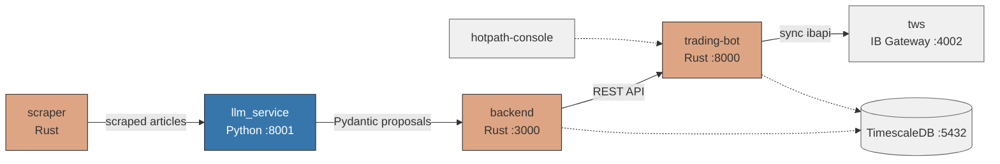
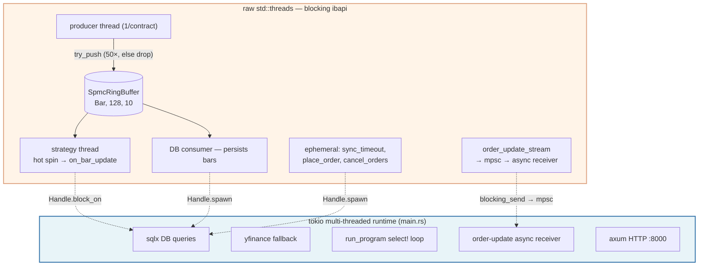

# rusty_trader

A personal live-trading system written in Rust and Python against Interactive Brokers' (IBKR) API. It scrapes financial news, runs an LLM research pipeline that produces portfolio proposals, feeds them to a Rust trading bot that ingests real-time market data, executes strategies over consolidated bars, reconciles state against the broker, and self-heals through IBKR's nightly restarts and connection drops.

> **Scope:** This has so far run against a paper-trading account at personal scale. It is not production financial infrastructure and makes no claims about fitness for live capital.

## Services

| Service                                 | Lang   | Port | Description                                                                                       |
| --------------------------------------- | ------ | ---- | ------------------------------------------------------------------------------------------------- |
| [`trading-app/`](trading-app/README.md) | Rust   | 8000 | The trading bot: sync `ibapi`, real-time bars, strategy execution, order management, self-healing |
| [`backend/`](backend/README.md)         | Rust   | 3000 | REST API: CRUD for positions/orders/transactions, portfolio, strategy control, notifications      |
| [`llm_service/`](llm_service/README.md) | Python | 8001 | LLM research pipeline: KB triage (STALE/COMPRESS/KEEP) → 5-stage proposal → counter-proposer      |
| [`scraper/`](scraper/)                  | Rust   | —    | Playwright article scraper → feeds `llm_service`                                                  |
| [`hotpath-console/`](hotpath-console/)  | —      | —    | Debug console sharing network with `trading-bot`                                                  |
| `IB/`                                   | —      | 4002 | IB Gateway (TWS) Docker image                                                                     |




## Architecture at a glance

The defining design decision in `trading-app` is that **`ibapi` is compiled with its `sync` feature**: every IBKR call blocks. This forces a split-world architecture — blocking IBKR I/O on raw `std::thread`s, async DB/HTTP on a tokio multi-threaded runtime, bridged by captured `tokio::runtime::Handle`s:


## Architecture at a glance

The defining design decision in `trading-app` is that **`ibapi` is compiled with its `sync` feature**: every IBKR call blocks. This forces a split-world architecture — blocking IBKR I/O on raw `std::thread`s, async DB/HTTP on a tokio multi-threaded runtime, bridged by captured `tokio::runtime::Handle`s:



Roughly seven thread categories coexist. Each is named (`qqq_stock_prod`, `noise_strat`, `order_update_stream`, …) so `top -H` / `perf` output maps directly to logical roles. The sync architecture keeps the strategy layer pure — adding a strategy is one line:

```rust
// trading-app/src/strategy/strategy.rs:110
strategy_enum! {
    Noise(Noise),
    Manual(Manual),
    Unknown(Unknown)
}
```

For the full reasoning (why sync, the `Handle::block_on` bridge, costs), see [`trading-app/README.md`](trading-app/README.md#threading-model--sync-ibapi).

## The data plane

```
   IBKR TWS
     │  5s bars (sync realtime_bars)
     ▼
 ┌─────────────────┐   try_push (50×, else drop bar)
 │ Producer thread │ ──────────────────┐
 └─────────────────┘                   ▼
                       ┌──────────────────────────────┐
                       │  SpmcRingBuffer<Bar, 128, 10>│
                       │  lock-free, cache-aligned    │
                       └──────────────────────────────┘
                          │  independent consumer heads
              ┌───────────┴────────────┐
              ▼                        ▼
      DB consumer thread        Strategy thread
      aggregate_bars            sort_consumers → spin-pop
      → create_or_update(DB)    aggregate_bars → dispatch_bar
      → live_prices moka cache  → strategy.on_bar_update (sync)
                                → order_engine.handle_bar_update_outcome
```

## Subsystem tour

Each subsystem is documented in [`trading-app/README.md`](trading-app/README.md) with verified code snippets:

- **[Database & CRUD](trading-app/README.md#database--crud-methods)** — proc-macro derives, generic `CRUD<FK,PK,UK>`, interface enum dispatch, bulk insert. Full schema: [`migrations/README.md`](trading-app/migrations/README.md).
- **[Execution](trading-app/README.md#execution)** — optimistic order rows (`perm_id=-1`), FX attachments, redb `OrderStore`, order-update stream, startup reconciliation.
- **[Strategy](trading-app/README.md#strategy)** — `strategy_enum!` macro, `BarUpdateOutcome`, rolling stats, `proportional_integer_reduce`.
- **[Scheduling](trading-app/README.md#scheduling--pure-helpers)** — three-tier purity model, `HashContract` hash/eq split, `sync_timeout`.
- **[Lifecycle](trading-app/README.md#lifecycle--self-healing)** — `AppReturnState` restart loop, log-stream-as-control-plane, `IBGateway` non-constructibility, `test_internals` seam.
- **[Testing](trading-app/README.md#testing)** — 3-tier suite (275 unit / 18 integration / 16 live-IBKR smoke).

## Environment

From [`.env.example`](.env.example):

| Var                                                           | Purpose                                       |
| ------------------------------------------------------------- | --------------------------------------------- |
| `TRADING_DB_URL`                                              | Postgres connection string for trading-bot    |
| `TEST_TRADING_DB_URL`                                         | Separate Postgres for tests (port 5433)       |
| `ASYNC_TRADING_DB_URL`                                        | Asyncpg connection string (Python backend)    |
| `DB_USER` / `DB_PW` / `DB_DB`                                 | Postgres credentials (used by docker-compose) |
| `BACKEND_BEARER_TOKEN`                                        | Bearer token for backend REST API             |
| `OPENROUTER_API_KEY` / `ANTHROPIC_API_KEY` / `GOOGLE_API_KEY` | LLM provider keys                             |
| `ALPACA_API_KEY` / `ALPACA_API_SECRET`                        | Alpaca market data keys                       |
| `TRADING_BOT_URL`                                             | Backend → trading-bot inter-service URL       |

## Build & test

Three test binaries in `trading-app/`:

| Binary              | Tests                                             | Needs                   |
| ------------------- | ------------------------------------------------- | ----------------------- |
| `unit_tests`        | 278 passing                                       | Nothing (offline)       |
| `integration_tests` | 168 passing (18 per-table CRUD + advanced DB ops) | PostgreSQL              |
| `smoke_tests`       | 91 passing (16 live tests)| IB Gateway + PostgreSQL |

```sh
docker-compose up test-trading-bot # Runs all tests from unit -> integration -> smoke tests
```

## Known rough edges & debt

- **Orphaned/dead files** — `threshold_rebalancing.rs`, `frac_mom_weekly_pos.rs`, `available_funds.rs`, `strategy_scheduler.rs` (non-compiling or commented out).
- **Forex `read_last_vwap` SQL** references non-existent columns — copy-paste from stock branch.
- **`IbkrState::async_drop`** consolidator spin-loop is a busy-wait with no sleep — hangs teardown if a clone leaks.
- **`sync_timeout` leaks threads on timeout** — Rust threads can't be cancelled.
- **Hardcoded deployment specifics** — paper account id, IBC install path, SGD base currency in source, not env.
- **Magic numbers** — `$1000` FX tolerance, `MAX_SUB_TRY_TIMES=50`, `HOT_WINDOW=200ms`. Tuned-in-practice, not parameterized.
- **`order_ref` overloaded as `"{strategy}:{price}"`** — stringly-typed contract with `.expect()` on parse.
- **FX calendar** uses a minimal 3-holiday set — `nyse-holiday-cal` might be better.
- **Permission stalls** — `get_current_price` can hang 30-45s per contract; multiply by N option contracts and `PendingDbQuery` can exceed the 1-min FX bar threshold. Check `hotpath-console` first.

## My journey

For the design memoir — the reasoning behind the architecture, the dead ends, and what I learned building this — see **[My journey →](YOUR_JOURNEY_URL)** on my personal page.

---

_Built by `RyanTYT`. Rust · Python · IBKR · PostgreSQL/TimescaleDB · tokio · redb · moka._
