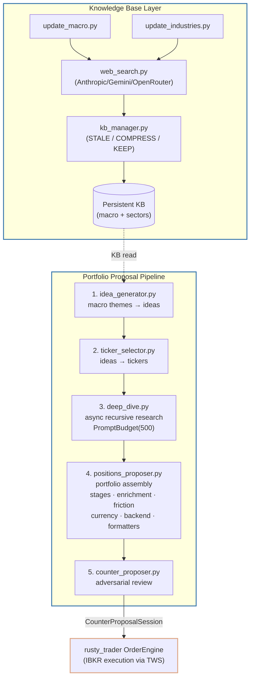

# llm_service
 
An LLM-powered research and portfolio proposal pipeline, designed as a microservice
within [rusty_trader](https://github.com/RyanTYT/rusty_trader). It produces structured,
Pydantic-validated position proposals that feed directly into the IBKR order engine —
no copy-pasting, no manual interpretation.
 
---
 
## Why Not Just Ask an LLM?
 
A direct chat prompt for investment research fails in four concrete ways:
 
1. **Stale data.** LLM training cutoffs lag the market by months. This system grounds
   every claim in live web search results before they enter the knowledge base.
2. **No memory.** Each prompt starts from zero. This system maintains a persistent,
   versioned KB of macro and industry analysis that improves across runs.
3. **Unstructured output.** Free text can't be validated, diffed, or piped downstream.
   Every stage here returns a typed Pydantic model.
4. **No challenge.** A single LLM call agrees with your framing. A dedicated
   counter-proposer agent pushes back before anything reaches the order engine.
---
 
## System Overview
 

 
---
 
## Knowledge Base: STALE / COMPRESS / KEEP
 
The KB update agents (`update_macro.py`, `update_industries.py`) run on a schedule.
For each existing KB entry, the agent classifies it before deciding what to do:
 
| Disposition | Meaning | Action |
|-------------|---------|--------|
| **KEEP** | Still accurate and current | Leave unchanged |
| **COMPRESS** | Valid but verbose | Condense in-place |
| **STALE** | Outdated fact | Rewrite with fresh web search results |
 
New topics discovered during web search are appended as new entries. The result is a
KB that gets denser and more accurate over time rather than drifting stale.
 
---
 
## Pipeline Stages
 
### Stage 1 — Idea Generation (`idea_generator.py`)
Reads the macro and industry KB. Produces a list of thematic investment ideas with
supporting rationale grounded in the KB context.
 
### Stage 2 — Ticker Selection (`ticker_selector.py`)
For each idea, selects specific tickers. Considers liquidity, market cap, and exchange
eligibility relative to the IBKR account's supported markets.
 
### Stage 3 — Deep Dive (`deep_dive.py`)
Async, recursive per-ticker research. Each ticker spawns web searches and follow-up LLM
calls to validate thesis, check recent earnings/guidance, and identify related tickers.
Governed by:
- `PromptBudget(max=500)` — hard cap on total LLM calls per run
- `TickerRelationMap` — tracks which tickers were discovered through which paths,
  enabling the proposer to understand and reason about cross-asset dependencies
### Stage 4 — Position Proposal (`positions_proposer.py`)
Assembles deep-dive outputs into a complete portfolio proposal:
- `stages.py` — orchestrates Stage 1–4 logic sequentially
- `enrichment.py` — enriches each position with ADV data and market context
- `friction.py` — pre-fetches transaction cost estimates for realistic sizing
- `currency.py` — normalises positions across currencies to the SGD base account
- `backend.py` — assembles the final weighted proposal
- `formatters.py` — shapes output for downstream consumption
- `prompts.py` — maintains all prompt templates in one place
### Stage 5 — Counter-Proposal (`positions_counter_proposer.py`)
An adversarial agent that receives the assembled proposal and generates structured
pushback: alternative theses, under-weighted risks, sizing challenges. Returns a typed
`CounterProposalSession` with both the original and counter alongside diff-ready
Pydantic models.
 
---
 
## Schema (key types)
 
```python
class ProposedPosition(BaseModel):
    ticker: str
    primary_exchange: str
    currency: str
    weight: float          # % of portfolio
    rationale: str
    risks: list[str]
 
class CounterProposalSession(BaseModel):
    original: list[ProposedPosition]
    counter: list[ProposedPosition]
    unchanged_positions: list[ProposedPosition]
    overall_challenge: str
    confidence: float
```
 
---
 
## LLM Provider Routing
 
`llm_client.py` wraps Anthropic, Gemini, and OpenRouter behind a single interface.
Provider choice is configurable per-agent in `settings_manager.py`:
 
| Agent | Recommended provider | Reason |
|-------|---------------------|--------|
| `positions_proposer` | Claude (Anthropic) | Best structured reasoning |
| `positions_counter_proposer` | Claude (Anthropic) | Needs to genuinely challenge |
| `deep_dive` | OpenRouter / Gemini | High call volume, cost sensitive |
| `update_macro` / `update_industries` | Gemini / OpenRouter | Routine summarisation |
 
---
 
## Getting Started
 
### Prerequisites
- Python 3.12+
- `uv` (package manager)
- API keys: `ANTHROPIC_API_KEY`, `GEMINI_API_KEY` (or `OPENROUTER_API_KEY`)
### Running locally
 
```bash
uv sync
uv run python main.py
```
 
### Running via Docker
 
```bash
docker build -t llm_service .
docker run --env-file .env llm_service
```
 
### Browsing the Knowledge Base
 
The FastAPI server at `api/kb_browser.py` exposes read endpoints for inspecting
current KB state:
 
```
GET /kb/macro            All macro entries
GET /kb/industries       All industry entries
GET /kb/macro/{topic}    Specific macro topic
```
 
---
 
## Project Structure
 
```
llm_service/
├── agents/
│   ├── positions_proposer_mods/
│   │   ├── stages.py         Stage 1–4 orchestration
│   │   ├── enrichment.py     ADV + market data enrichment
│   │   ├── friction.py       Transaction cost pre-fetch
│   │   ├── currency.py       Multi-currency normalisation
│   │   ├── backend.py        Proposal assembly
│   │   ├── formatters.py     Output formatting
│   │   └── prompts.py        Prompt templates
│   ├── deep_dive.py          Async recursive ticker research
│   ├── idea_generator.py     Thematic idea generation
│   ├── positions_counter_proposer.py  Adversarial review
│   ├── positions_proposer.py Pipeline orchestrator
│   ├── ticker_selector.py    Ticker selection
│   ├── update_industries.py  Industry KB update agent
│   └── update_macro.py       Macro KB update agent
├── api/
│   └── kb_browser.py         FastAPI KB read endpoints
├── models/
│   ├── settings_manager.py   Provider config + budget limits
│   └── types.py              Pydantic schemas
├── tools/
│   ├── field_corrector.py    LLM output schema repair
│   ├── kb_manager.py         KB CRUD + triage logic
│   ├── llm_client.py         Unified multi-provider LLM client
│   └── web_search.py         Web search abstraction
├── Dockerfile
├── main.py                   Entry point
└── pyproject.toml
```
