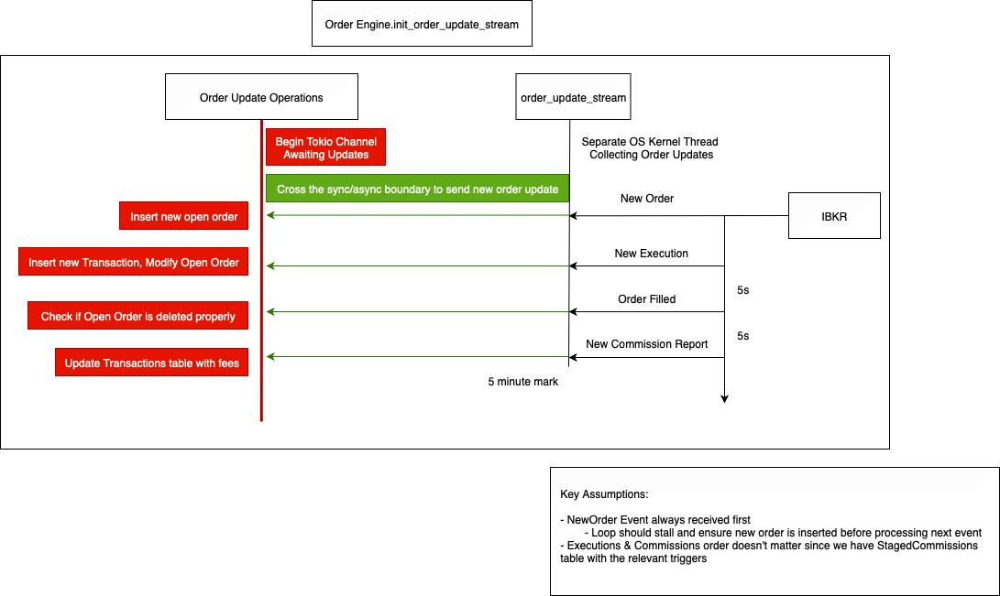
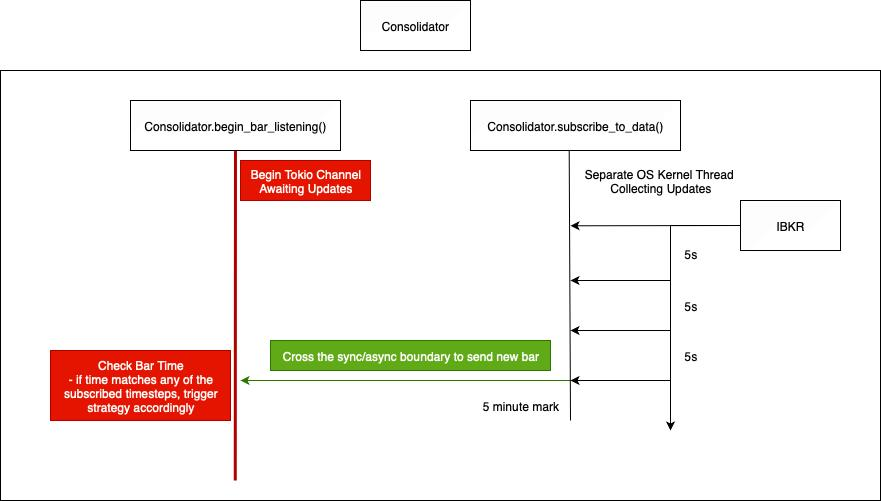
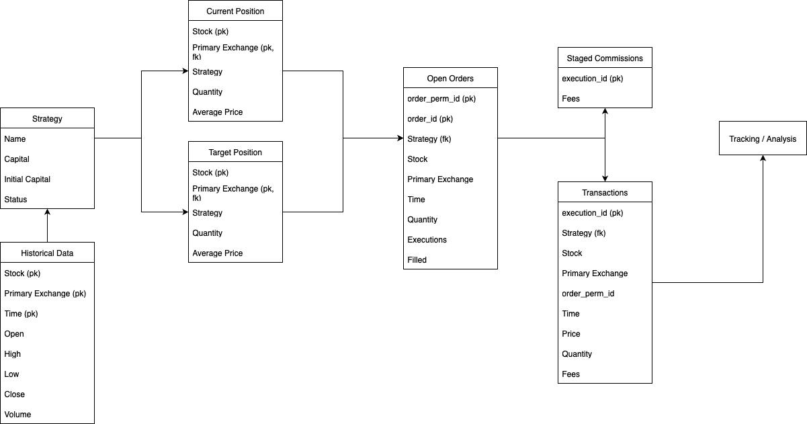

# Rusty Trader – Backend Architecture
A Rust implementation of a trading bot connected to Interactive Brokers (IBKR) via the official rust-ibapi.

---

This backend is designed for fully automated execution, strategy management, and data consolidation, while maintaining a clean, extensible architecture.

## Motivation: Why a Complete Refactor from Python? I had a key preconceived notions that was mostly wrong:
- I thought Rust would only shine if the IBKR client library was fully asynchronous.
    - I realized that most strategies operate synchronously, with each strategy on its own thread.
In fact, other than that, Rust provided key upgrades over Python:
- Static typing & compiler guarantees → caught bugs early, cleaner abstractions.
- Closer to the metal → avoiding “black box” async wrappers (ib_async) made architecture more intuitive.
- Transparent subscriptions → unlike global, opaque event handlers, rust-ibapi gives crystal-clear control over what gets subscribed to, and how events are processed.

## Architecture Overview

### Unified Order Management System (OMS)

Instead of listening to scattered events after placing orders, I now run a centralized Order Engine.
This OMS listens to all order-related events from IBKR and updates system state consistently.
Before: ad-hoc listeners attached per strategy.
Now: one Order Engine handles everything, ensuring clean, reliable updates.
Order Engine Architecture

### Consolidator: Subscription Abstraction

The Consolidator is a key piece that manages all market data subscriptions:
- Ensures no duplicate subscriptions for the same contract.
- Automatically re-subscribes if data goes stale.
- Provides a unified trigger layer for all strategies.
This prevents subscription sprawl and keeps contract data consistent.

### Final Flow: End-to-End System
Here’s how updates flow through the system:

## Database Layer
The system is built around a PostgreSQL backend with carefully designed tables:
CurrentPosition → live portfolio holdings.
TargetPosition → desired holdings per strategy.
Transaction → all executions, reconciled via OMS.
HistoricalData → price and contract history for backtesting and live monitoring.
DB triggers with StagedCommissions help maintain referential integrity and reduce redundant computation.

## Implementation Notes
Funnily enough, building this wasn’t as trivial as I initially envisioned. While the current repo looks clean and straightforward, it took a month of full-time work:
- Multiple iterations of schema design and DB triggers.
- Careful choice of concurrency primitives:
  - std::sync::Mutex vs tokio::sync::Mutex.
  - OS kernel threads vs tokio tasks for infinite loops.
  - Iterative improvements to ensure stability and scalability.
Much of this isn't shown in the public repo since the published version is a skeleton for architecture showcase.

The actual strategies remain private while I test and refine them.

## Future Work
- Add WebSocket layer for frontend updates.
- Debug a few issues in the architecture
