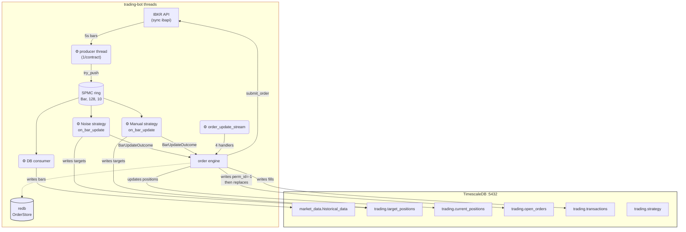
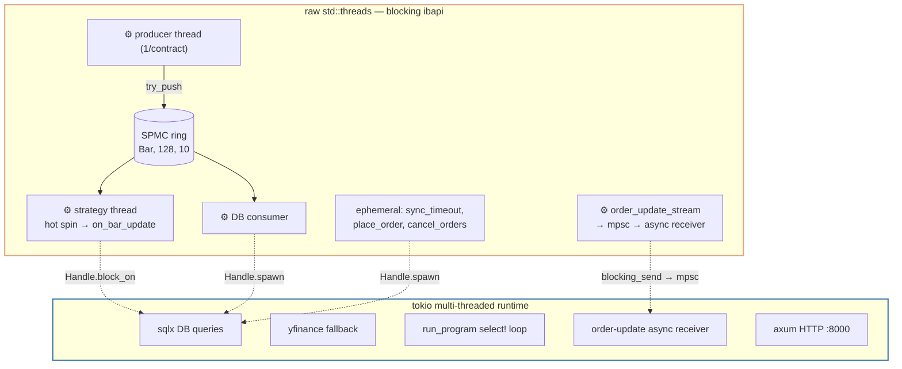
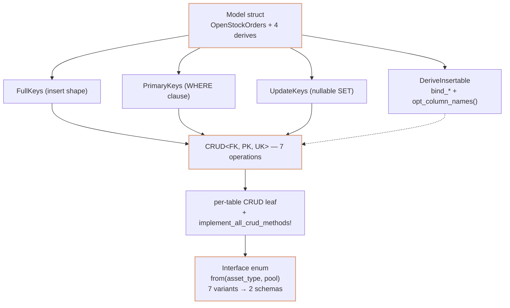
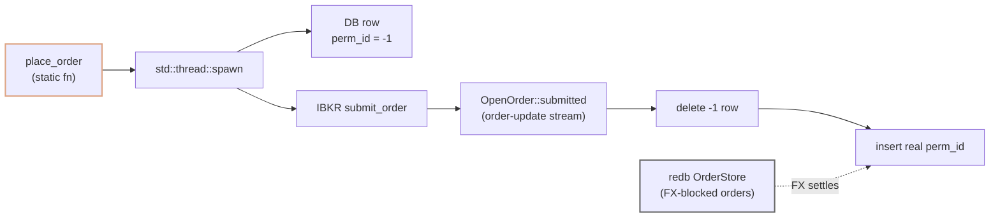
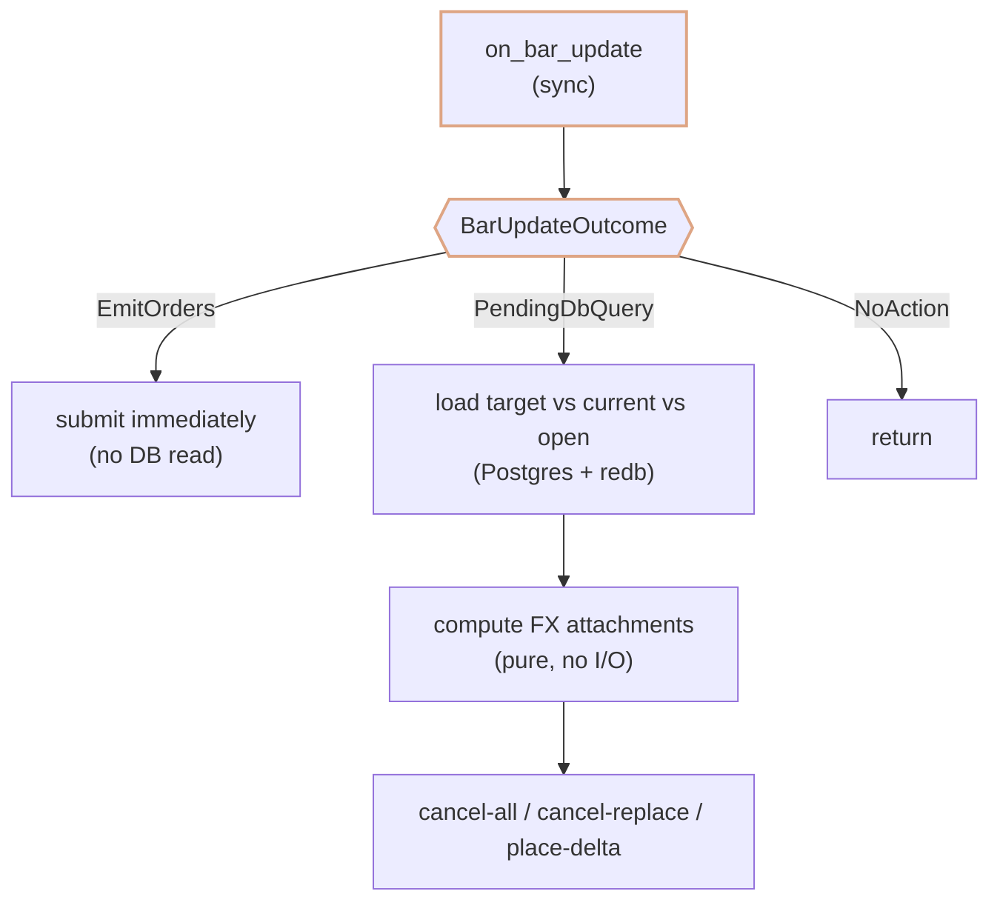
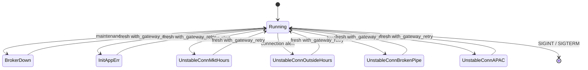

# trading-app

The Rust trading bot at the core of [rusty_trader](../../README.md). It connects to IB Gateway via a sync `ibapi` fork, ingests real-time 5-second bars, runs strategies over consolidated bars, reconciles state against the broker, and self-heals through IBKR's nightly restarts and connection drops.

> **Navigating the monorepo:** For the backend REST API, see [`api/backend/README.md`](../api/backend/README.md). For the LLM research pipeline, see [`ai/llm_service/README.md`](../ai/llm_service/README.md). For the database schema, see [`migrations/README.md`](migrations/README.md).

---

## Overview

The trading-bot's threads and their interactions with the database:



All DB access happens via `Handle.block_on` / `Handle.spawn` — the threads are raw `std::thread`s, but the DB queries are dispatched onto the tokio runtime. The strategy threads and order engine also **read** from `target_positions`, `current_positions`, and `open_orders` during reconciliation (reads omitted from the diagram for clarity). See [Threading model](#threading-model--sync-ibapi) for the bridge details.

---

## Threading model & sync ibapi

The defining design decision: **`ibapi` is compiled with its `sync` feature** — every IBKR call blocks. This forces a split-world architecture: blocking IBKR I/O runs on raw `std::thread`s, async DB/HTTP work runs on a tokio multi-threaded runtime, and the two are bridged by captured `tokio::runtime::Handle`s.

The bridge in action — `on_bar_update` is a sync `fn` that spawns async DB tasks and joins them:

```rust
// strategy/noise.rs:85 — on_bar_update is SYNC, runs on a dedicated OS thread
fn on_bar_update(
    &self,
    contract: &Contract,
    bar: &HistoricalDataFullKeys,
    consolidator: &Arc<Consolidator>,
) -> Result<BarUpdateOutcome, String> {
    match self._on_bar_update(contract, bar, consolidator) {
        Ok(v) => Ok(v),
        Err(v) => Ok(v),
    }
}
```

Inside `_on_bar_update`, the async bridge:

```rust
// strategy/noise.rs:233 — block_on is legal here because this thread
// is NOT a tokio worker. It's a dedicated OS thread spawned by hook_strategy.
let (avg_move_since_open_joined, most_recent_open_joined,
     most_recent_daily_vol_joined, vwap_joined,
) = hotpath::measure_block!("noise_join_db_queries", {
    self.tokio_handle.block_on(async {
        tokio::join!(
            avg_move_since_open_thread,
            most_recent_open_thread,
            most_recent_daily_vol_thread,
            vwap_thread,
        )
    })
});
```

**Benefits of sync:**
- **No async colour propagation.** If `on_bar_update` were `async`, every I/O function it calls would need `.await` + `Send + 'static` bounds rippling through the strategy layer. Sync keeps it a plain function; only the single DB seam pays the async tax.
- **Real backtraces.** A panic on a strategy thread gives a stack trace through code → ibapi → syscall. Async task panics give a waker chain that's much harder to read.
- **Simple shutdown.** `std::thread` + `is_alive: Arc<AtomicBool>` checked in the loop is dead-simple. Async cancellation is subtler — abort is async, tasks may be mid-`.await`.

**The costs:**
- **`Handle::block_on` panics** if the calling thread is already inside a tokio context. This single rule is why the strategy must run on a non-runtime OS thread, which is why `hook_strategy` spawns a `std::thread`, which is why `warm_up_data` (the one async strategy method) must be wrapped in `spawn_blocking`. The whole topology is downstream of this one precondition.
- **Doesn't scale to high fanout.** Thread-per-operation would explode with thousands of concurrent streams. Fine here; not fine for a high-fanout service.



---

## Database & CRUD methods

A three-tier design that gets ~98 method bodies (7 operations × ~14 tables) from one template. Design leverages `Option`-ness to deduce the schema metadata.

```rust
// database/models.rs:280 — Option-ness determines key-set membership
#[derive(
    Debug, Clone, Serialize, Deserialize,
    ExtractFullKeys,      // all fields, Option<T> unwrapped → insert shape
    ExtractPrimaryKeys,   // non-Option fields only → WHERE-clause identity
    ExtractUpdateKeys,    // only Option<T> fields, kept as Option → nullable SET targets
    DeriveInsertable, FromRow,
)]
pub struct OpenStockOrders {
    pub order_perm_id: i32,            // non-Option → primary key
    pub order_id: i32,                 // non-Option → primary key
    pub strategy: Option<String>,      // Option → nullable SET target
    pub stock: Option<String>,
    pub primary_exchange: Option<String>,
    pub currency: Option<String>,
    pub time: Option<DateTime<Utc>>,
    pub quantity: Option<f64>,
    pub executions: Option<Vec<String>>,
    pub filled: Option<f64>,
}
```

`DeriveInsertable` generates column-name lists and `bind_*` methods. Its `opt_column_names()` is runtime-dynamic, so `update()` emits SQL with only the columns actually set — partial updates for free.

A generic `CRUD<FK, PK, UK>` blanket impl provides all seven CRUD operations for any key-set triple implementing `Insertable`. Two delegation macros layer further: one for single-table wrappers, one for enum dispatch.

Interface enums (`OpenOrdersCRUD`, `CurrentPositionsCRUD`, `TransactionsCRUD`, `TargetPositionsCRUD`, `HistoricalDataCRUD`) dispatch by `AssetType` via a `from(asset_type, pool)` constructor that collapses 7 asset-type variants into 2 storage shapes (futures/CFD/forex/cash share the stock schema). Variant mismatch returns `Err` — a runtime guard for an invariant the type system can't express.

Bulk insert uses a separate high-throughput tier: temp table → binary `COPY IN` → dedup (reverse iteration + `HashSet` = last-write-wins) → `INSERT ... ON CONFLICT DO UPDATE`. A background batching channel flushes on size/time/close triggers, with RAII flush on `Drop`.

For the full table schema (columns, types, triggers), see [`migrations/README.md`](migrations/README.md).



---

## Execution

`OrderEngine` is deliberately thin — just a `PgPool` and a `tokio::Handle`; `Client` and `OrderStore` are threaded in as method args, so it owns no IBKR lifecycle.

The key pattern: **optimistic order rows**. `place_order` writes a DB row keyed by `perm_id = -1` (a sentinel) *before* IBKR confirms, then returns the `order_id` immediately:

```rust
// execution/order_engine.rs:111 — place_order is a static fn, returns i32
pub fn place_order(
    handle: tokio::runtime::Handle,
    pool: PgPool,
    weak_client: &Weak<Client>,
    order_ibkr: OrderIBKR,
) -> i32 {
    let client = weak_client.upgrade().unwrap();
    let order_id = client.next_order_id();
    std::thread::spawn(move || {
        client.submit_order(order_id, &order_ibkr.contract, &order_ibkr.order);
        // ...
        let pk = OpenOrdersPrimaryKeys::new(&asset_type, -1, order_id);  // sentinel
        let uk = OpenOrdersUpdateKeys::new(&asset_type, &order_ibkr.contract, &order_ibkr.order);
        handle.spawn(async move {
            let open_orders_crud = OpenOrdersCRUD::from(&asset_type, pool);
            open_orders_crud.create_or_update(&pk, &uk).await;  // optimistic DB row
        });
    });
    order_id  // returned before IBKR confirms
}
```

The real `OpenOrder::submitted` event later deletes the `-1` placeholder and inserts the real row. Crash-recovery-safe; the race window is mitigated by defensive double-deletes on cancel.

Other execution subsystems:
- **Positional parent attachment.** `references_parent_order: i32` is a positional index into the input `Vec` (`-1` = none, `>=0` = parent's position). O(1) parent-ID resolution — brittle to reordering.
- **Reconciliation.** `handle_bar_update_outcome` dispatches `BarUpdateOutcome`: `EmitOrders` → submit immediately; `PendingDbQuery` → load target-vs-current-vs-open-orders (from Postgres *and* redb), compute FX attachments, then cancel-all / cancel-and-replace / place-the-delta.
- **FX attachments are pure.** `get_required_fx_attachments` is an associated function (no `&self`) that consumes three `HashMap`s by value — no I/O. Greedy shortfall satisfaction.
- **redb `OrderStore`.** An embedded ACID KV store (postcard-serialized) backing orders that can't yet be submitted because their FX precondition hasn't settled. Keeps IBKR-unknown orders out of the `OpenOrders` table while surviving crashes.
- **Order-update stream.** A three-thread fan-out — sync subscriber thread (`next_timeout(5s)`) → per-event OS thread → 1024-cap tokio mpsc → async receiver dispatching to four handlers (`open_order`, `order_status`, `execution`, `commission_report`). A `static AtomicUsize` + `compare_exchange` enforces singleton.
- **Startup reconciliation.** `SyncerEngine` runs three syncs: executions (reuses the live handler over a 10s-bounded subscription), open orders, and positions (per-currency FX via `account_updates` `CashBalance`).



---

## Strategy

The `StrategyExecutor` trait carries a heavy super-trait bound - from legacy implementation:

```rust
// strategy/strategy.rs:25 — the trait
#[async_trait::async_trait]
pub trait StrategyExecutor: Ord + PartialOrd + Eq + PartialEq + Clone + Send + Sync {
    fn get_name(&self) -> String;
    fn on_bar_update(
        &self,
        contract: &Contract,
        bar: &HistoricalDataFullKeys,
        consolidator: &Arc<Consolidator>,
    ) -> Result<BarUpdateOutcome, String>;
    fn get_contracts(&self, client: Arc<Client>) -> Vec<Contract>;
    async fn warm_up_data(&self, consolidator: &Arc<Consolidator>) -> Result<(), String>;
    fn is_fx_strategy(&self) -> bool;
}
```

Adding a strategy is implementation of trait and one line in the macro invocation:

```rust
// strategy/strategy.rs:110 — adding a strategy is just one line
strategy_enum! {
    Noise(Noise),
    Manual(Manual),
    Unknown(Unknown)
}
```

The strategy → execution contract is a two-path enum:

```rust
// strategy/strategy.rs:14
pub enum BarUpdateOutcome {
    EmitOrders(Vec<OrderIBKR>),      // fast path — submit immediately
    PendingDbQuery(Vec<AssetType>),  // "I wrote target positions; reconcile me"
    NoAction,                        // no action for this bar tick
}
```

Other strategy infrastructure:
- **Rolling statistics.** Nine pure rolling-stat structs (`RollingMax/Min/Sum/Std/ZScore/RankPct/EwmMean/Roc/Mean`), `Decimal`-internal for lossless finance math with an f64 façade. `EwmMean` implements pandas' `adjust=False` EWMA with O(1) `replace_last`. `RollingRankPct` uses a `BTreeMap<OrderedFloat, usize>` multiset for sub-linear percentile queries.
- **`proportional_integer_reduce`** solves the indivisible-shares problem: real-valued proportional scaling always under-spends (sum of floors ≤ floor of the sum); this function greedily reduces the number of shares to just below the limit.



---

## Scheduling & pure helpers

A clean three-tier model, separated by purity:

- **Tier 1 (pure) — broker availability.** `IbkrRegion` / `IbkrStateService`: knows only the weekly maintenance window (Fri 23:00 → Sat 03:00 ET). Pure chrono arithmetic; no I/O.
- **Tier 2 (orchestrator) — `run_program`.** Consumes Tier 1 to gate the outer loop; owns the `tokio::select!` over sleep-to-broker-down / connection alerts / SIGTERM / SIGINT.
- **Tier 3 (per-contract) — `IbkrContractScheduler`.** Parses IBKR `liquid_hours`/`trading_hours` strings into a `BTreeMap<NaiveDate, Option<TradingHours>>`, imputes missing days, and checks *yesterday's* schedule first to catch sessions spanning midnight.

The subtlest helper is `HashContract` — custom `Hash` on a normalized subset, bare `impl Eq` backed by derived raw `PartialEq`:
- Notably, this design is not as good as I would like it and am thinking of phasing this out soon

```rust
// helpers/contract.rs:16
#[derive(Debug, Clone, PartialEq)]
pub struct HashContract {
    pub contract: Contract,
}

impl Hash for HashContract {
    fn hash<H: std::hash::Hasher>(&self, state: &mut H) {
        self.contract.primary_exchange.as_str().trim().hash(state);  // trimmed
        self.contract.symbol.as_str().hash(state);
        self.contract.currency.as_str().hash(state);
        self.contract.security_type.to_string().hash(state);
        if self.contract.security_type == SecurityType::Option {
            self.contract.right.hash(state);
            self.contract.last_trade_date_or_contract_month.hash(state);
            ordered_float::OrderedFloat(self.contract.strike).hash(state);
            self.contract.multiplier.hash(state);
        }
    }
}

impl Eq for HashContract {}  // relies on derived PartialEq (raw, no trim)
```

`sync_timeout` is a pure std-only timeout for sync ibapi calls: spawn OS thread + `mpsc` + `recv_timeout`. Bounds blocking calls without holding a tokio worker. Cost: the worker thread is leaked on timeout — Rust threads can't be cancelled.

---

## Lifecycle & self-healing

`run_program` is the outer restart loop. `AppReturnState` is a typed algebra of every way an iteration can end:

```rust
// schedule/program_scheduler.rs:45
pub enum AppReturnState {
    BrokerDown,
    InitAppErr(String),
    NoBrokerSchedule(String),
    UnstableConnMktHours,
    UnstableConnOutsideHours(DateTime<Tz>),
    UnstableConnBrokenPipe,
    UnstableConnAPAC,
    SigintTerminalSignal,
    SigtermTerminalSignal,
}
```

Only the two signal variants are terminal — every other state `continue`s the loop, re-booting the entire IBKR stack:

```rust
// schedule/program_scheduler.rs:210 — the restart loop
app_return_state.log_state();
if app_return_state.is_terminal_state() {
    break 'outer;  // only Sigint/Sigterm
}
// implicit continue → fresh with_gateway_retry → fresh init_app
```

The `tokio::select!` inside the loop:

```rust
// schedule/program_scheduler.rs:152
tokio::select! {
    _ = sleep_until(&next_unavailable_utc) => {
        return AppReturnState::BrokerDown;
    }
    Some(connection_alert) = interrupt_rcx.recv() => {
        // → UnstableConnMktHours / OutsideHours / BrokenPipe / APAC / AutoRestarting
    }
    _ = sigterm.recv() => return AppReturnState::SigtermTerminalSignal,
    _ = sigint.recv() => return AppReturnState::SigintTerminalSignal,
}
```

**Log-stream-as-control-plane.** `IbConnectionLayer` is a `tracing` `Layer` that inspects every ERROR/WARN event's message for IBKR error codes (`1100`/`1102` stale, `111` refused, `Broken pipe`, `timed out waiting for next bar`). It runs a state machine that consults pure datetime predicates (`is_autorestart`, `is_apac_reset_now`, `is_any_open`) to classify the outage and emit `ConnectionAlert`s. Powerful but fragile — an ibapi string reformat silently breaks detection.

**Structural `IBGateway` lifecycle safety.** `IBGateway` is intentionally non-constructible externally — private fields, no `pub fn new()`:

```rust
// ibc.rs:22
pub struct IBGateway {
    child: Child,        // private
    shut_down: bool,     // private
}

// The only public entry points — borrow, never hand out ownership:
pub async fn with_gateway<F, Fut, T>(log_file: &str, f: F) -> Result<T, String>
where
    F: FnOnce(&IBGateway) -> Fut,
    Fut: Future<Output = T>,
```

`with_gateway` / `with_gateway_retry` own both halves (start → use → shutdown) in one place. There is no code path that returns an owned `IBGateway` to the caller, so it's structurally impossible to obtain one and forget to shut it down.

**`test_internals` test seam.** Source functions stay `pub(crate)`; a cfg-gated module re-exports `pub` wrappers:

```rust
// lib.rs:14
#[cfg(any(test, feature = "test-utils"))]
pub mod test_internals {
    pub use crate::helpers::contract::{HashContract, LocalContractTypes};
    pub use crate::ibc::IBGateway;
    // ...
    pub fn build_contract_from_stock(
        stock: &String,
        primary_exchange: &String,
        currency: &String,
    ) -> ibapi::contracts::Contract {
        crate::helpers::contract::build_contract_from_stock(stock, primary_exchange, currency)
    }
}
```

A self-dev-dependency (`trading-app = { path = ".", features = ["test-utils"] }`) makes `tests/` binaries auto-build with the feature. Zero prod-code impact.



---

## Testing

Three test binaries, each with a different dependency profile:

| Binary | Tests | Needs | How to run |
|---|---|---|---|
| `unit_tests` | 278 passing | Nothing (offline) | `SQLX_OFFLINE=true cargo test --test unit_tests` |
| `integration_tests` | 168 passing (18 per-table CRUD + 3 advanced DB test files) | PostgreSQL | `DATABASE_URL=… cargo test --test integration_tests` |
| `smoke_tests` | 91 passing (16 `#[ignore]`d live tests | IB Gateway + PostgreSQL | `cargo test --test smoke_tests -- --ignored` |

The offline unit suite (275 tests, no DB/IBKR) is the bulk of coverage. It tests the pure functions that the sync architecture keeps pure: FX attachment math, bar aggregation, rolling stats, `HashContract` hash/eq, FX datetime predicates. The `test_internals` seam (above) is what makes this possible — `pub(crate)` functions become reachable from `tests/` without touching prod visibility.

Integration tests cover per-table CRUD (variant dispatch, mismatch `Err`), advanced DB operations (`update_positions_additive` weighted-avg / cross-direction / zero, `read_last_n`, `read_last_vwap`, `get_target_pos_diff_by_pk`, bulk `COPY IN` + dedup + merge), and bulk insert.

Smoke tests run against a live IB Gateway + PostgreSQL: 11 smoke tests + 5 comprehensive flow tests (find trading contracts, full place/reverse/zero flow, edge cases for invalid contract / market closed / cancel open order).

---

## Extending it

### Add a strategy

1. Implement `StrategyExecutor` for a new struct (the trait requires `Ord`/`Eq`/`Clone`/`Send`/`Sync` — hand-write `Ord` as `priority.cmp().then(name.cmp())`).
2. Add one line to the `strategy_enum!` invocation in `strategy/strategy.rs`: `NewVariant(NewStruct)`.
3. Construct it in `init_strategies` (`init_app.rs`) with its `DataSubscription` list and a cloned `tokio::runtime::Handle`.

That's the entire wiring — the macro generates the enum variant, the `Hash`-by-name, and the delegation impl. Strategies are dispatched statically (no `dyn`).

### Add a table

1. Define the model struct in `database/models.rs` with the four key-set derives (`ExtractFullKeys + ExtractPrimaryKeys + ExtractUpdateKeys + DeriveInsertable`) and `FromRow`.
2. Create the table in a new migration under [`migrations/`](migrations/README.md).
3. Add a per-table CRUD leaf in `database/models_crud/` (a thin wrapper around `CRUD<…FullKeys, …PrimaryKeys, …UpdateKeys>` + the `implement_all_crud_methods!` macro + a `new(pool)` with the table name).
4. If it follows the stock/option duality, add a variant to the relevant interface enum (`OpenOrdersCRUD`, etc.) and its parallel key enums.

### Use the test seam

Add `#[cfg(any(test, feature = "test-utils"))]` to keep source items `pub(crate)` in prod but reachable from `tests/` via `trading_app::test_internals::…`. The `test-utils` cargo feature + self-dev-dependency auto-enables it for `cargo test`.

---

## Thoughts

If you've been following since the beginning, you might remember a trading-app-old service that was the legacy Python Build. Firstly, that was really badly built as I didn't fully understand async runtimes back then, nor did I understand locks, and many other things I learnt along the way. Python is nice for quick and easy, but gets really bad and annoying to follow after significant code buildup (i.e. it offers ease in trade for significant technical debt). I initially pursued the Rust version only because I wanted the static typing, and wanted to learn Rust, but it's taught me more than a few things along the way, and this current architecture would certainly be significantly more laborious to implement in Python now - using a multi-threaded async runtime alongside kernel threads (which would have flown right over my head back then).

Anyway, locks are lame and annoying but is something you reach for when you start learning Rust from scratch. After a while though, you realise most of the time locks like Mutexes just introduce unnecessary complexity as well as overhead - most of the time, locks aren't fully necessary; use a lock-free data structure or create one yourself instead (though arguably atomic operations use hardware locks so you never really do stray too far away from locks).

The actual strategies remain private while I test and refine them.

---

_Built by `RyanTYT`. Rust · IBKR · PostgreSQL/TimescaleDB · tokio · redb · moka._
